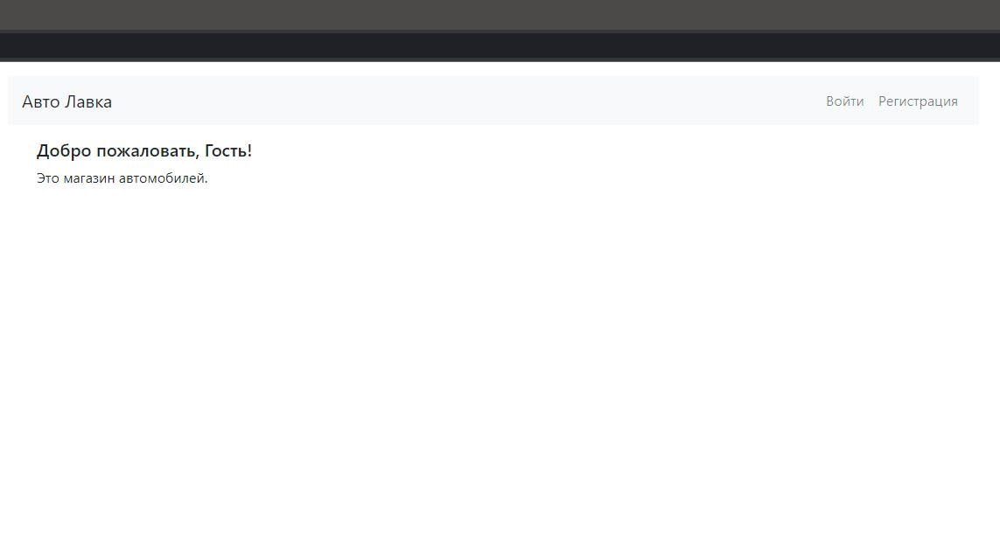
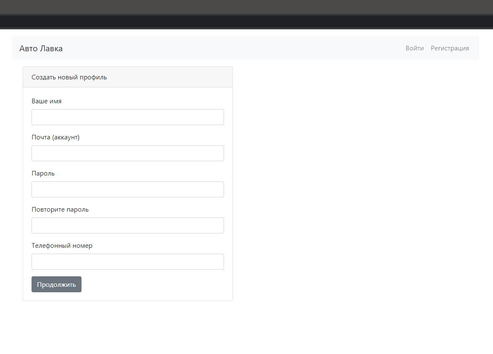
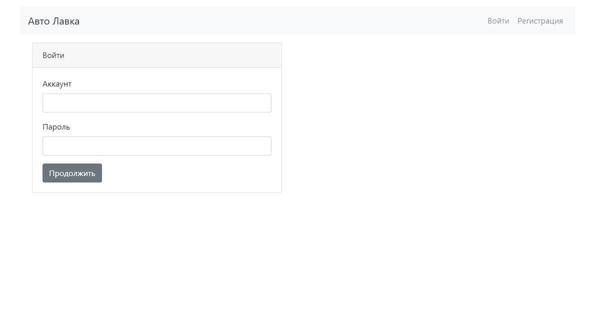
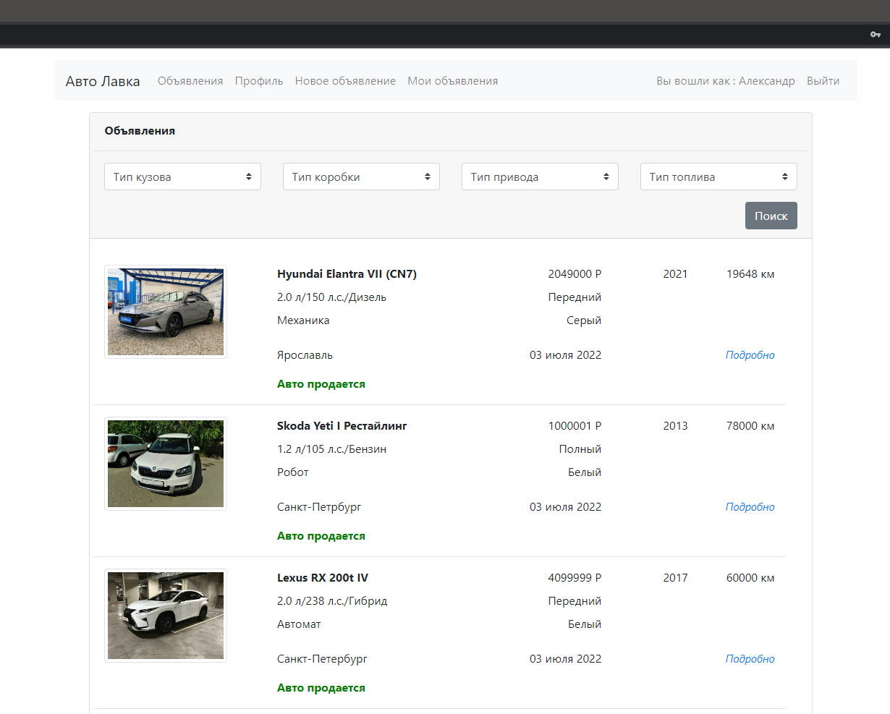
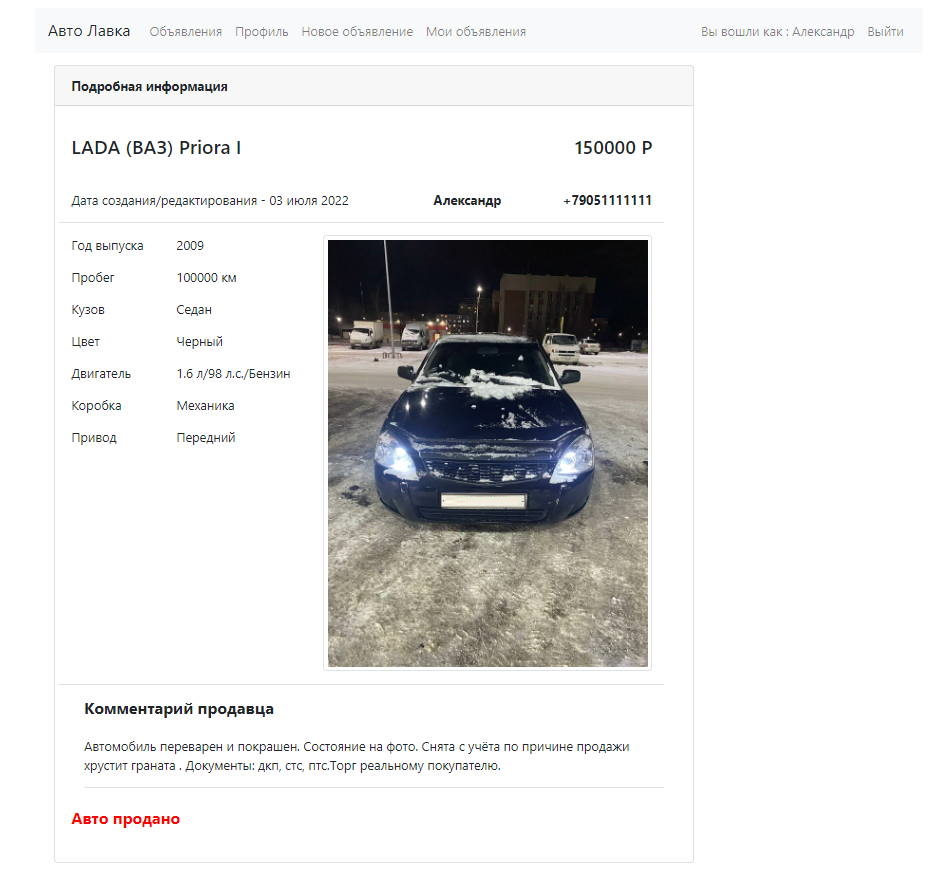
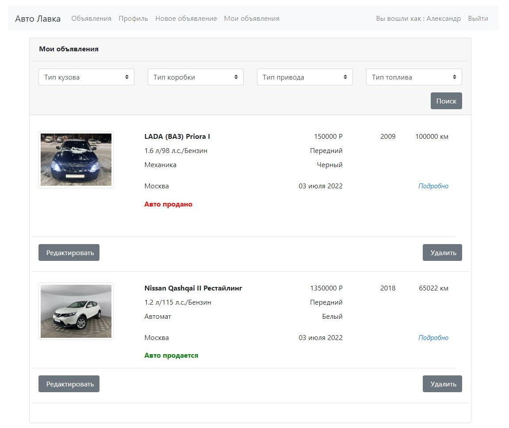
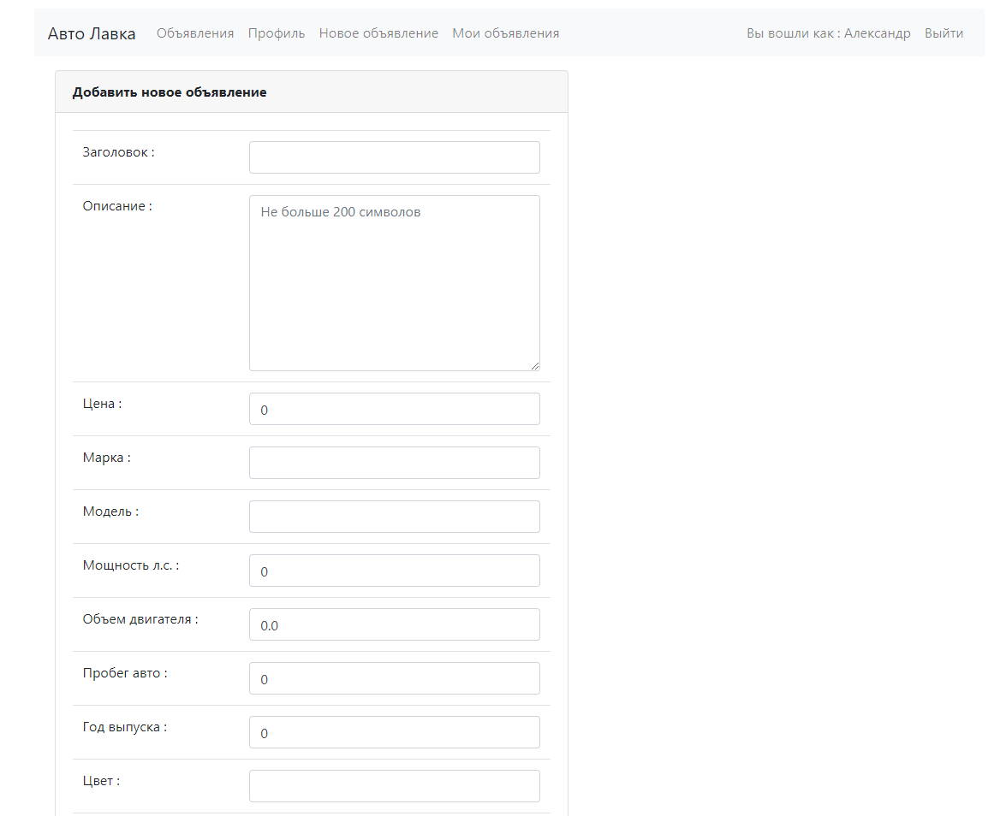
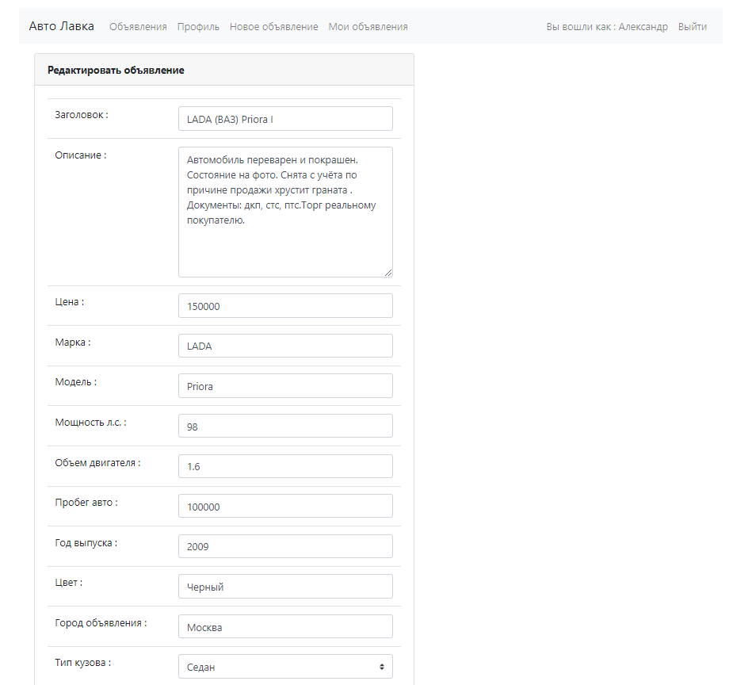

#job4j_cars

# job4j_cars

## Описание проекта
Web приложение, площадка для размещения объявлений для продажи автомобилей.
# Функционал:
- Регистрация пользователей, доступно редактирование профиля.
- Аутентификация и авторизация пользователей через Servlet Filter.
- Добавление, редактирование, удаление объявлений.
- Просмотр списка своих объявлений.
- Изменения статуса объявлений, перевод в категорию проданных.
# Применяемые технологии:
* Java 14
* Spring Boot 2,  Java EE Servlets
* HTML, Bootstrap CSS, Thymeleaf
* Hibernate, PostgreSQL
* JUnit, Mockito
# Применяемые инструменты:
* Maven, Checkstyle

## Примеры работы:

### 0. Страница приветствия.
Со страницы приветствия пользователь может перейти к регистрации, либо к странице входа.

### 1. Регистрация пользователя.
Каждому пользователю выдается пара наименование аккаунта (email) и пароль.
Помимо имени аккаунта и пароля указываются: имя пользователя и телефон, эта контактная
информация отображаются на странице объявления.

### 2. Страница входа.
Для входа необходимо ввести пароль и электронную почту (наименование аккаунта), указанную при регистрации.

### 3. Список всех объявлений.
На странице выводится список всех объявлений пользователей сайта.

### 4. Страница объявления с подробностями.
На странице выводится объявление со всей доступной информацией: комментарии продавца,
контактная информация (имя, телефон).

### 5. Страница "моих" объявлений.
На странице выводится объявления созданных пользователем приложения.
Присутствуют кнопки редактирования и удаления объявлений.

### 6. Страница создания объявления.
На странице заполняется информация по продаваемому автомобилю, при 
необходимости загружается фотография.

### 7. Страница редактирования объявления.
На странице редактируется информация по поданному ранее объявлению.

